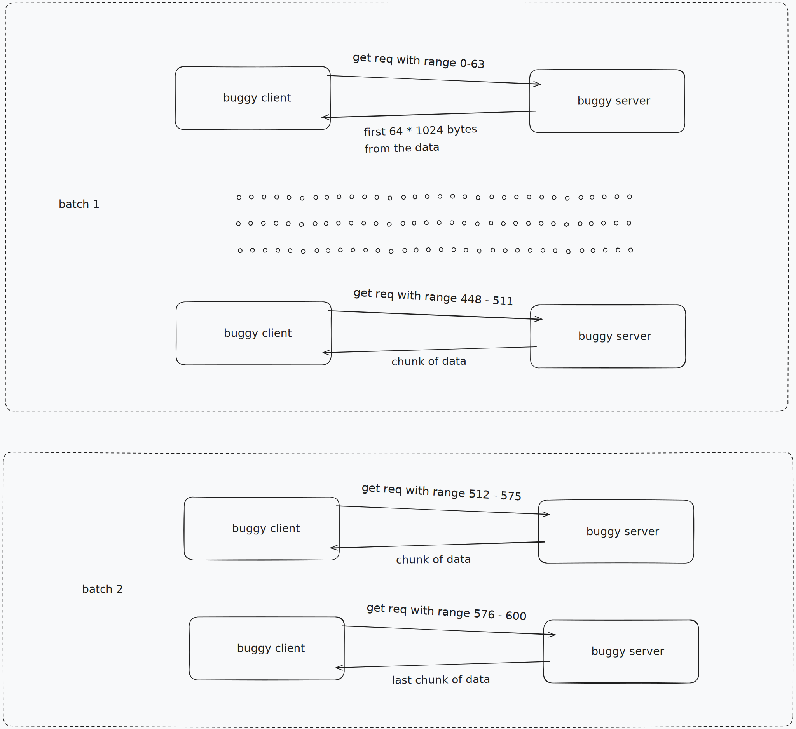
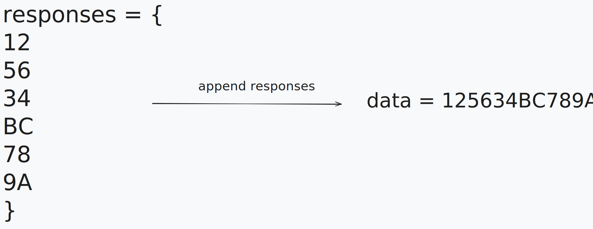
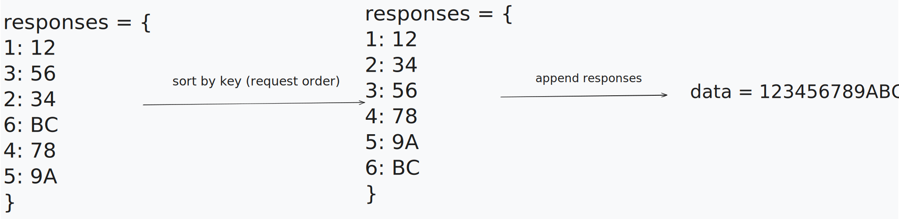

# HTTP File Downloader - JetBrains Internship Task

A client application that reliably downloads binary data from a glitchy HTTP server.

## Usage

### Run the server in one terminal

```shell
python buggy_server.py
```

### Run the client in another terminal

```shell
cd buggy_client
cargo run 
```

or

```shell
cd buggy_client
cargo build
./target/debug/buggy_client
```

### The client supports several command-line options:

```
USAGE:
    buggy_client [OPTIONS]

OPTIONS:
    -h, --host <HOST>              Server hostname or IP address [default: 127.0.0.1]
    -p, --port <PORT>              Server port [default: 8080]
    -c, --chunk-size <SIZE>        Chunk size in KiB [default: 64]
    -t, --threads <NUM>            Number of concurrent downloads [default: 4]
    -o, --output <FILE>            Save downloaded data to FILE
    -v, --verify <HASH>            Verify SHA-256 hash of downloaded data
    --verbose                      Enable verbose output with detailed error messages
    --help                         Print help information
```

### Example with options:

```shell
    ./target/debug/buggy_client -t 8 -o downloaded_file.bin --verbose
```

## Additional Features

- Progress Visualization: Visual progress bars show overall and per-thread download status
- File Saving: Downloaded data can be saved directly to a file
- Checksum Verification: Optional SHA-256 hash verification

## So what's the challenge?

The problem is that if the response has more than 64KiB (wich is guaranteed, as the data
is between 512KiB and 1024KiB) the data that gets sent as a response is truncated to a random
size between 64KiB bytes and the full length. Here is a simple sketch showing how would that look:


So, if we want to receive a predictable amount of data, we have to get it in chunks of 64KiB bytes
at a time, at most. This can be achieved by adding the **Range** header to the server request. With
it we specify what part of the data to get. Here is how you would get the first chunk of the data:


To get the whole data from the server we have to make multiple chunk requests and append the responses.
This could take up to 16 seconds (in the worst the data has the max length of 1024KiB
and every request takes 1 second, so 16 chunks of 64KiB bytes with a second per chunk - 16s).
That if we make the requests one after the other, but if we make them concurently in batches of 8
we could take the total response time down to two seconds.



The problem with that would be that appending responses wouldn't be as simple as before, because
of the random response times (and even if the response times would be the same, the correct ordering
still wouldn't be guaranteed because of how concurency works).



So to solve that problem, we should associate some kind of id to each request so that we can
re-arrange the responses in the correct order after receiveing all of them.



## Observations

After I implemented the concurent version and tested both version, I can say that I some wrong
assumptions, the most obvious being that concurrent doesn't mean faster, it depends on the load
of the task. For our use case, threads actually slowed down the whole process (probably because creating
a thread actually takes a lot of resources on it's own, and the benefits are not felt for this use case),
the first version averaging around 5-6 seconds, while the "better" solution avereging 7-8 seconds.
Also it didn't help that I had to make a new connection to the server for every request, but I think
that was probably intentional.
